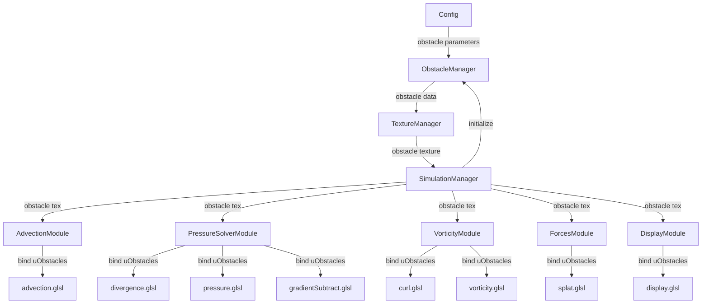

# Obstacle System Architecture Design

## Executive Summary

This document specifies the architecture for adding obstacle support to the fluid simulation. It defines data structures, class interfaces, module interactions, and integration points based on the research and codebase analysis completed in Phases 1-2.

**Approach**: Binary obstacle mask texture (as recommended in `implementation_approaches.md`)

---

## 1. System Overview

### 1.1 Architecture Diagram



### 1.2 Data Flow

```
Initialization:
  Config → ObstacleManager → generates obstacle data
  → TextureManager.createObstacleTexture() → obstacle texture
  → Stored in SimulationManager
  → Passed to all physics & rendering modules

Each Frame:
  All shaders sample obstacle texture
  → Apply appropriate boundary conditions
  → Skip/modify computation based on obstacle presence
```

---

## 2. Core Data Structures

### 2.1 Obstacle Mask Texture

**Purpose**: Store binary obstacle/fluid classification for each grid cell

**Specification**:
```
Format: R8 or R16F (single channel, 8 or 16-bit)
Resolution: Same as SIM_RESOLUTION (e.g., 128×128)
Data:
  - 0.0 = fluid cell
  - 1.0 = obstacle cell
Filtering: NEAREST (no interpolation for binary mask)
Wrap Mode: CLAMP_TO_EDGE
```

**Memory Footprint**:
- R8: 128×128 × 1 byte = 16 KB
- R16F: 128×128 × 2 bytes = 32 KB

**WebGL Texture Object**:
```javascript
{
    texture: WebGLTexture,   // GL texture handle
    width: 128,
    height: 128,
    attach(id) → id          // Utility for binding to texture unit
}
```

### 2.2 Obstacle Definition (CPU-Side)

**Purpose**: Define obstacle geometry before rasterization to texture

**Structure**:
```javascript
{
    type: string,          // 'circle' | 'rectangle'
    x: number,             // Normalized x [0, 1]
    y: number,             // Normalized y [0, 1]
    
    // Circle-specific
    radius?: number,       // Normalized radius [0, 1]
    
    // Rectangle-specific
    width?: number,        // Normalized width [0, 1]
    height?: number        // Normalized height [0, 1]
}
```

**Example Obstacles**:
```javascript
// Circle obstacle at center
{
    type: 'circle',
    x: 0.5,
    y: 0.5,
    radius: 0.1
}

// Rectangle obstacle as vertical wall
{
    type: 'rectangle',
    x: 0.3,
    y: 0.2,
    width: 0.05,
    height: 0.6
}
```

---

## 3. New Module: ObstacleManager

### 3.1 Class Specification

**File**: `src/core/ObstacleManager.js`

**Purpose**:
- Generate obstacle mask data from obstacle definitions
- Provide API for adding/removing obstacles
- Support future dynamic obstacle updates

**Interface**:
```javascript
export class ObstacleManager {
    constructor(width, height, config);
    
    // Obstacle manipulation
    addCircle(x, y, radius): void;
    addRectangle(x, y, width, height): void;
    clear(): void;
    
    // Data generation
    getObstacleData(): Float32Array;
    
    // Future: dynamic updates
    updateTexture(gl, texture): void;
}
```

### 3.2 Implementation Details

**Fields**:
```javascript
class ObstacleManager {
    width: number;           // Grid width
    height: number;          // Grid height
    config: Config;          // Configuration reference
    obstacleData: Float32Array;  // CPU-side mask data
    obstacles: Array<ObstacleDefinition>;  // List of obstacles
}
```

**Constructor**:
```javascript
constructor(width, height, config) {
    this.width = width;
    this.height = height;
    this.config = config;
    
    // Allocate obstacle mask (initialized to all fluid)
    this.obstacleData = new Float32Array(width * height);
    this.obstacles = [];
    
    // Add default obstacles from config
    if (config.DEFAULT_OBSTACLES) {
        config.DEFAULT_OBSTACLES.forEach(obs =>this.addObstacle(obs));
    }
}
```

**Add Circle Method**:
```javascript
addCircle(cx, cy, radius) {
    // Convert normalized coords to grid coords
    const gridX = cx * this.width;
    const gridY = cy * this.height;
    const gridRadius = radius * this.width;  // Assume square grid
    
    // Rasterize circle to mask
    for (let j = 0; j < this.height; j++) {
        for (let i = 0; i < this.width; i++) {
            const dx = i - gridX;
            const dy = j - gridY;
            const dist = Math.sqrt(dx*dx + dy*dy);
            
            if (dist <= gridRadius) {
                const idx = j * this.width + i;
                this.obstacleData[idx] = 1.0;  // Mark as obstacle
            }
        }
    }
    
    // Store definition
    this.obstacles.push({ type: 'circle', x: cx, y: cy, radius });
}
```

**Add Rectangle Method**:
```javascript
addRectangle(x, y, width, height) {
    // Convert normalized coords to grid coords
    const gridX = x * this.width;
    const gridY = y * this.height;
    const gridW = width * this.width;
    const gridH = height * this.height;
    
   // Rasterize rectangle to mask
    for (let j = 0; j < this.height; j++) {
        for (let i = 0; i < this.width; i++) {
            if (i >= gridX && i < gridX + gridW &&
                j >= gridY && j < gridY + gridH) {
                const idx = j * this.width + i;
                this.obstacleData[idx] = 1.0;  // Mark as obstacle
            }
        }
    }
    
    // Store definition
    this.obstacles.push({ type: 'rectangle', x, y, width, height });
}
```

**Get Obstacle Data**:
```javascript
getObstacleData() {
    return this.obstacleData;
}
```

**Clear Method**:
```javascript
clear() {
    // Reset all cells to fluid
    this.obstacleData.fill(0.0);
    this.obstacles = [];
}
```

---

## 4. Modified Modules

### 4.1 TextureManager

**File**: `src/core/TextureManager.js`

**New Method**:
```javascript
/**
 * Create obstacle texture from data
 * 
 * @param {number} width - Texture width
 * @param {number} height - Texture height
 * @param {Float32Array} data - Obstacle mask data
 * @returns {Object} Texture object with attach method
 */
createObstacleTexture(width, height, data) {
    const gl = this.gl;
    const ext = this.ext;
    
    // Choose format based on available extensions
    // R8: if EXT_texture_rg available
    // RGBA8: fallback (use R channel, waste 3 channels)
    const useR8 = ext.formatR;
    
    const internalFormat = useR8 ? ext.formatR.internalFormat : gl.RGBA;
    const format = useR8 ? ext.formatR.format : gl.RGBA;
    const type = gl.UNSIGNED_BYTE;
    
    // Convert Float32Array to Uint8Array
    const uint8Data = new Uint8Array(width * height);
    for (let i = 0; i < data.length; i++) {
        uint8Data[i] = data[i] > 0.5 ? 255 : 0;  // Binary: 0 or 255
    }
    
    // If using RGBA, expand to 4 channels (RGBARGBA...)
    let uploadData = uint8Data;
    if (!useR8) {
        uploadData = new Uint8Array(width * height * 4);
        for (let i = 0; i < uint8Data.length; i++) {
            uploadData[i * 4] = uint8Data[i];  // R channel
            uploadData[i * 4 + 1] = 0;         // G
            uploadData[i * 4 + 2] = 0;         // B
            uploadData[i * 4 + 3] = 255;       // A
        }
    }
    
    // Create texture
    const texture = gl.createTexture();
    gl.bindTexture(gl.TEXTURE_2D, texture);
    gl.texParameteri(gl.TEXTURE_2D, gl.TEXTURE_MIN_FILTER, gl.NEAREST);
    gl.texParameteri(gl.TEXTURE_2D, gl.TEXTURE_MAG_FILTER, gl.NEAREST);
    gl.texParameteri(gl.TEXTURE_2D, gl.TEXTURE_WRAP_S, gl.CLAMP_TO_EDGE);
    gl.texParameteri(gl.TEXTURE_2D, gl.TEXTURE_WRAP_T, gl.CLAMP_TO_EDGE);
    gl.texImage2D(gl.TEXTURE_2D, 0, internalFormat, width, height, 0, format, type, uploadData);
    
    // Return texture object with utility method
    let textureId = -1;
    return {
        texture,
        width,
        height,
        attach(id) {
            gl.activeTexture(gl.TEXTURE0 + id);
            gl.bindTexture(gl.TEXTURE_2D, texture);
            textureId = id;
            return id;
        },
        read: { texture, attach: function(id) {  // Compatibility with FBO interface
            gl.activeTexture(gl.TEXTURE0 + id);
            gl.bindTexture(gl.TEXTURE_2D, texture);
            return id;
        }}
    };
}
```

### 4.2 SimulationManager

**File**: `src/core/SimulationManager.js`

**Modified Fields**:
```javascript
class SimulationManager {
    // ... existing fields
    obstacleManager: ObstacleManager;  // NEW
    obstacle: ObstacleTexture;          // NEW
}
```

**Modified `init()` Method** (after shader loading, ~line 100):
```javascript
async init() {
    // ... existing WebGL setup and shader loading
    
    // NEW: Create obstacle manager
    this.obstacleManager = new ObstacleManager(
        this.config.SIM_RESOLUTION,
        this.config.SIM_RESOLUTION,
        this.config
    );
    
    // ... continue with module initialization
}
```

**Modified `_initFramebuffers()` Method** (after creating pressure FBO, ~line 280):
```javascript
_initFramebuffers() {
    // ... existing FBO creation (velocity, dye, pressure, divergence, etc.)
    
    // NEW: Create obstacle texture
    const obstacleData = this.obstacleManager.getObstacleData();
    this.obstacle = this.textureManager.createObstacleTexture(
        this.config.SIM_RESOLUTION,
        this.config.SIM_RESOLUTION,
        obstacleData
    );
    
    // ... continue with remaining FBOs
}
```

**Modified Module Constructors** (pass obstacle texture):
```javascript
// Physics modules
this.advectionModule = new AdvectionModule(
    this.gl, this.programs, this.fboManager, this.obstacle  // NEW param
);

this.pressureSolverModule = new PressureSolverModule(
    this.gl, this.programs, this.fboManager, this.textureManager, this.obstacle  // NEW param
);

this.vorticityModule = new VorticityModule(
    this.gl, this.programs, this.fboManager, this.obstacle  // NEW param
);

this.forcesModule = new ForcesModule(
    this.gl, this.programs, this.fboManager, this.obstacle  // NEW param
);

// Rendering module
this.displayModule = new DisplayModule(
    this.gl, this.programs, this.fboManager, this.obstacle  // NEW param
);
```

### 4.3 Physics Module Modifications

**Pattern for All Physics Modules**:

**Constructor**: Accept and store obstacle texture
```javascript
constructor(gl, programs, fboManager, obstacleTexture) {
    // ... existing initialization
    this.obstacleTexture = obstacleTexture;  // NEW
}
```

**Render Methods**: Bind obstacle texture before blit
```javascript
someMethod(...) {
    this.someProgram.bind();
    
    // ... existing uniform setup
    
    // NEW: Bind obstacle texture
    gl.uniform1i(
        this.someProgram.uniforms.uObstacles,
        this.obstacleTexture.attach(2)  // Use texture unit 2 consistently
    );
    
    this.fboManager.blit(output);
}
```

**Note**: Texture unit 2 chosen to avoid conflicts (0 and 1 typically used for source fields)

---

## 5. Configuration Updates

### 5.1 Config.js Additions

**File**: `src/config.js`

**New Fields**:
```javascript
// Obstacle Configuration
this.OBSTACLES_ENABLED = true;
this.OBSTACLE_COLOR = { r: 0.2, g: 0.2, b: 0.3 };  // Dark gray/blue

// Default obstacles
this.DEFAULT_OBSTACLES = [
    {
        type: 'circle',
        x: 0.5,
        y: 0.5,
        radius: 0.1
    }
];
```

**Validation Methods**:
```javascript
validateObstacleRadius(value) {
    return Math.max(0.01, Math.min(0.5, value));
}

validateObstaclePosition(value) {
    return Math.max(0.0, Math.min(1.0, value));
}
```

---

## 6. Module Interaction Sequence

### 6.1 Initialization Sequence

```
1. SimulationManager.init()
   ├─ Load Config
   ├─ Setup WebGL context
   ├─ Load shaders (with uObstacles uniform)
   ├─ Create ObstacleManager (reads DEFAULT_OBSTACLES from config)
   └─ Create modules
   
2. SimulationManager._initFramebuffers()
   ├─ Create velocity, pressure, divergence FBOs
   ├─ ObstacleManager.getObstacleData() → Float32Array
   ├─ TextureManager.createObstacleTexture() → obstacle texture
   ├─ Store in this.obstacle
   └─ Pass to module constructors
```

### 6.2 Update Loop Sequence (Each Frame)

```
SimulationManager.update(dt):
  
  1. Advect Velocity
     AdvectionModule.advect(velocity, velocity, dt, ...)
     → advection.glsl samples uObstacles
     → Clamps traced positions if land in obstacles
  
  2. Advect Dye
     AdvectionModule.advect(dye, velocity, dt, ...)
     → Same obstacle handling
  
  3. Apply Vorticity
     VorticityModule.compute(velocity)
     → curl.glsl: skips obstacles
     → vorticity.glsl: doesn't apply force in obstacles
  
  4. Pressure Projection
     a. PressureSolverModule.computeDivergence()
        → divergence.glsl: reflects velocity at obstacles
     
     b. PressureSolverModule.solvePressure()
        → pressure.glsl: Neumann BC, doesn't solve in obstacles
     
     c. PressureSolverModule.subtractGradient()
        → gradientSubtract.glsl: zeros velocity in obstacles
  
  5. Render
     DisplayModule.display(dye)
     → display.glsl: renders obstacles with OBSTACLE_COLOR
```

---

## 7. Texture Unit Management

### 7.1 Texture Unit Allocation

Consistent texture unit assignment across all shaders:

| Unit | Purpose | Bound Texture |
|------|---------|---------------|
| 0 | Primary input (velocity, pressure, etc.) | Varies by shader |
| 1 | Secondary input (divergence, dye, etc.) | Varies by shader |
| 2 | **Obstacle mask** | `obstacle.texture` (constant) |
| 3+ | Reserved for future use | - |

**Example (pressure shader)**:
```javascript
gl.uniform1i(program.uniforms.uPressure, pressure.attach(0));  // Unit 0
gl.uniform1i(program.uniforms.uDivergence, divergence.attach(1));  // Unit 1
gl.uniform1i(program.uniforms.uObstacles, obstacle.attach(2));  // Unit 2 (NEW)
```

### 7.2 Shader Uniform Naming

**Convention**: All shaders use `uObstacles` for obstacle texture
```glsl
uniform sampler2D uObstacles;
```

---

## 8. Error Handling & Validation

### 8.1 Obstacle Generation Validation

```javascript
addCircle(x, y, radius) {
    // Validate inputs
    x = this.config.validateObstaclePosition(x);
    y = this.config.validateObstaclePosition(y);
    radius = this.config.validateObstacleRadius(radius);
    
    // Warn if obstacle too small
    if (radius * this.width < 3) {
        console.warn('Obstacle radius very small (<3 cells), may not flow correctly');
    }
    
    // ... rasterization
}
```

### 8.2 Texture Creation Validation

```javascript
createObstacleTexture(width, height, data) {
    // Validate dimensions
    if (width !== height) {
        console.warn('Non-square obstacle texture may cause issues');
    }
    
    // Validate data length
    if (data.length !== width * height) {
        throw new Error(`Obstacle data length mismatch: expected ${width*height}, got ${data.length}`);
    }
    
    // ... texture creation
}
```

---

## 9. Performance Considerations

### 9.1 Texture Binding Overhead

**Issue**: Binding textures has small cost

**Mitigation**:
- Bind obstacle texture once per shader, not per fragment
- Use consistent texture unit (unit 2) to minimize state changes

### 9.2 Branching in Shaders

**Issue**: Dynamic branching can reduce performance on older GPUs

**Mitigation**:
- Keep branches simple (single `if` check)
- Obstacle cells spatially coherent → good branch prediction
- Early return in obstacle cells minimizes wasted computation

### 9.3 Memory Bandwidth

**Issue**: Additional texture lookup per fragment

**Measurement**:
- Current: ~3-5 texture lookups per shader
- With obstacles: +1 lookup = ~4-6 total
- Increase: ~17-20%

**Real Impact**: Minimal, as computation-bound not memory-bound

---

## 10. Testing Strategy

### 10.1 Unit Testing

**ObstacleManager Tests**:
- Test circle rasterization correctness
- Test rectangle rasterization correctness
- Test overlap handling
- Test boundary cases (edge obstacles)

### 10.2 Integration Testing

**Texture Creation**:
- Verify obstacle texture created correctly
- Check texture binding in each shader
- Validate texture unit management

### 10.3 Visual Testing

**Flow Patterns**:
- Fluid flows around circular obstacle (von Kármán vortex street)
- Fluid flows around rectangular obstacle (recirculation zones)
- No penetration through obstacles
- Velocity is zero in obstacle cells

---

## 11. Future Extensions

### 11.1 Dynamic Obstacles

**Current**: Static obstacles (set at initialization)

**Future**:
- Update obstacle texture each frame
- `ObstacleManager.updateTexture(gl, texture)` method
- `gl.texSubImage2D()` for efficient updates

### 11.2 User-Drawn Obstacles

**UI**:
- Click and drag to draw obstacles
- Brush size control
- Erase mode

**Implementation**:
- Track mouse position
- Add cells to obstacle mask in real-time
- Upload updated mask to GPU

### 11.3 SDF Upgrade (Phase 2)

**Motivation**: Smoother boundaries, sub-cell accuracy

**Path**: Replace R8 mask with R16F SDF
- Requires SDF generation algorithm
- Shader modifications to use distance queries
- Backward compatible with mask approach

---

## 12. Summary

This architecture provides:
- ✅ Clear separation of concerns (ObstacleManager handles generation, TextureManager handles GL)
- ✅ Minimal coupling (obstacle texture passed as dependency)
- ✅ Consistent interface (all modules receive obstacle texture same way)
- ✅ Performance-conscious (single texture, minimal branching)
- ✅ Extensible (easy to add new obstacle types or dynamic updates)
- ✅ Well-documented (clear data structures and interfaces)

**Next Steps**: Proceed to shader modification plan (Phase 3b)

---

*Architecture design based on research findings and codebase analysis. All design decisions justified by academic references or proven implementation patterns.*
