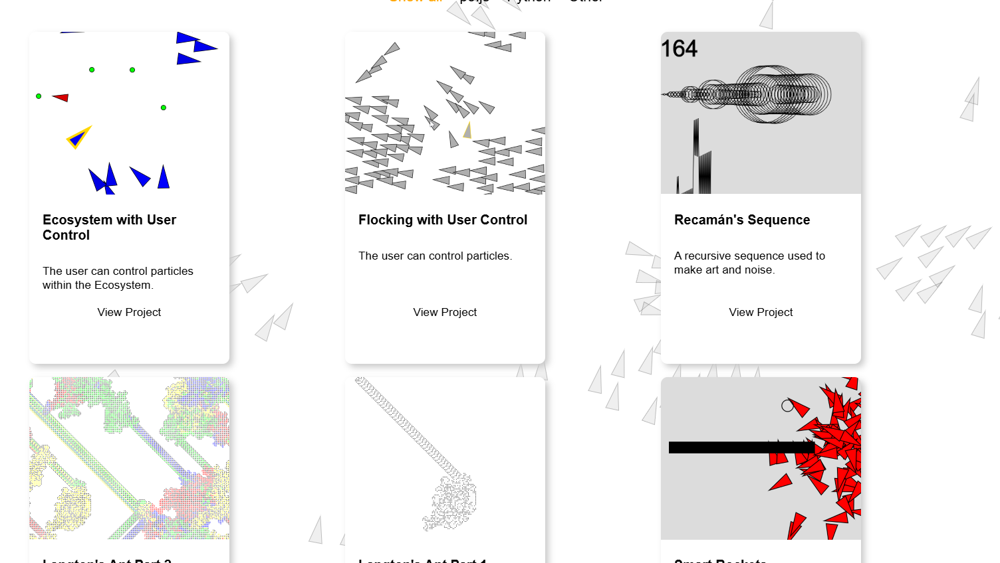
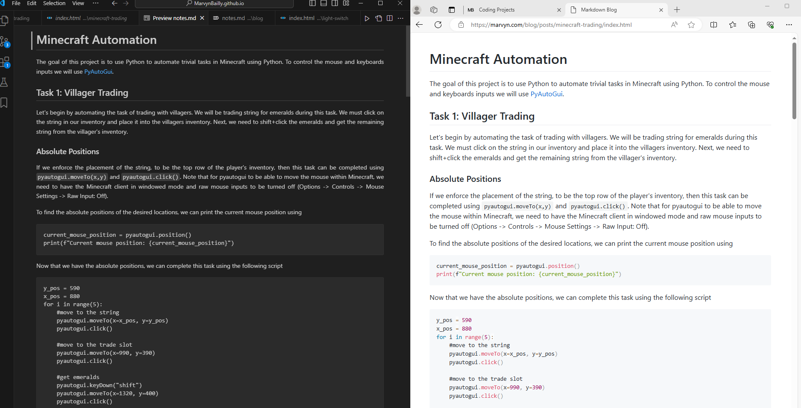
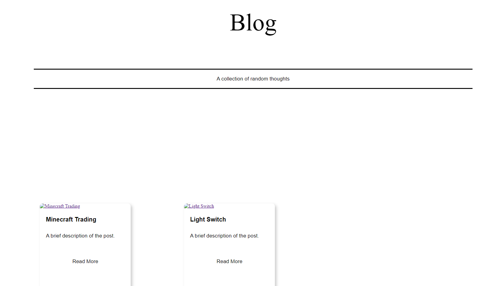
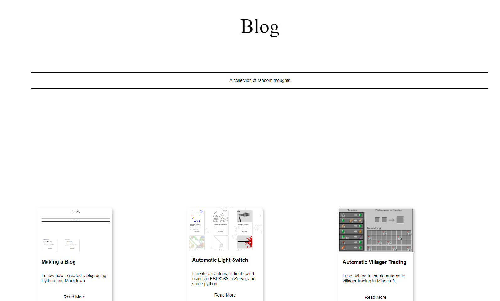

[comment]: <> (Title: Making a Blog)
[comment]: <> (Description: I show how I created a blog using Python and Markdown)
[comment]: <> (Cover image path: nodups.PNG)


# Creating a Blog

So I want to create a blog using Markdown and my existing website. My goal is to create a program that is easy to add to my website which converts notes written in Markdown files into blog post. 

## Existing Code

I will be building from the following html code which I've previously created for my website t o display content in an adaptive grid:

```
<div class="row">
    <!-- item 1 -->
    <div class="column js">
        <div class="content">
            <a href="link to html"></a>
            <div class="description">
                <h1>Title</h1>
                <p>Description</p>
            </div>
            <div class="buttonholder">
                <button><a href="link to html">View Project </a></button>
            </div>
        </div>
    </div>
    <!-- item 2 -->
    <div class="column js">
        <div class="content">
            <a href="link to html"></a>
            <div class="description">
                <h1>Title</h1>
                <p>Description</p>
            </div>
            <div class="buttonholder">
                <button><a href="link to html">View Project </a></button>
            </div>
        </div>
    </div>
</div>
```



## Rendering Markdown in HTML

We can easily render Markdown in html using zero-md:
```
<!DOCTYPE html>
<html lang="en">
<head>    
  <meta charset="UTF-8">
  <meta name="viewport" content="width=device-width, initial-scale=1.0">
  <title>Markdown Blog</title>
  <!-- Load polyfills only when necessary -->
  <script src="https://cdn.jsdelivr.net/npm/@webcomponents/webcomponentsjs@2/webcomponents-loader.min.js"></script>
  <!-- Load the element definition -->
  <script type="module" src="https://cdn.jsdelivr.net/gh/zerodevx/zero-md@1/src/zero-md.min.js"></script>
</head>
<body>
  <!-- Simply set the `src` attribute to your MD file and win -->
  <zero-md src="notes.md"></zero-md>
</body>
</html>
```
Note that images and gifs in the .md files need local file paths.

We can make the blog look nice by changing the style:
```
<style>
    body {
        font-family: Arial, sans-serif;
        max-width: 800px;
        margin: auto;
        padding: 20px;
    }
    zero-md {
        display: block;
        margin-top: 20px;
    }
</style>  
```



## Automatically creating HTML

Now we could manually create a new item in the original code and a corresponding html entree for the markdown but that is too much work. Let's create a Python script to do it. Firstly, we will use the following file structure:

```
blog
├── posts
│   ├── project_name1
│   │   └── notes.md
│   ├── project_name2
│   │   └── notes.md
├── index.html
└── generate_submission.py
```

Here `index.html` is a landing page that has original grid template shown before. `generate_submission.py` is a python script that will parse the post directory and generate html in `index.html`.  


### Basic Set up
Firstly, let's create a python script that opens the post file and finds each of the project files. The script continues to use a template from the original html:
```
# Template for each post div
post_div_template = '''
<div class="column code">
    <div class="content">
        <a href="{post_url}"></a>
        <div class="description">
            <h1>{post_title}</h1>
            <p>{post_excerpt}</p>
        </div>
        <div class="buttonholder">
            <button><a href="{post_url}">Read More</a></button>
        </div>
    </div>
</div>
'''
```
The Python script populates the template and inserts the html into `index.html`:
```
import os

# Get the absolute path to the current directory
current_dir = os.path.dirname(os.path.abspath(__file__))
# Path to the folder containing Markdown files
posts_dir = os.path.join(current_dir, 'posts')
# Path to the HTML file
html_file = os.path.join(current_dir, 'index.html')
# Base URL for the posts

# Base URL for the posts
base_url = 'https://marvyn.com/blog/posts/'

# Template for each post div
post_div_template = '''
<div class="column code">
    <div class="content">
        <a href="{post_url}"></a>
        <div class="description">
            <h1>{post_title}</h1>
            <p>{post_excerpt}</p>
        </div>
        <div class="buttonholder">
            <button><a href="{post_url}">Read More</a></button>
        </div>
    </div>
</div>
'''

def generate_post_divs(posts_dir):
    if not os.path.exists(posts_dir):
        print(f'The directory {posts_dir} does not exist.')
        return ''

    post_divs = ''
    for root, dirs, files in os.walk(posts_dir):
        print(f'Inspecting directory: {root}')  # Debug print
        print(f'Found directories: {dirs}')  # Debug print
        print(f'Found files: {files}')  # Debug print
        if 'notes.md' in files:
            post_dir = os.path.relpath(root, posts_dir)
            post_name = os.path.basename(root)
            post_url = f'{base_url}{post_dir}'
            post_title = post_name.replace('-', ' ').title()
            post_excerpt = 'A brief description of the post.'
            post_image = 'https://marvyn.com/images/default_thumbnail.png'  
            post_divs += post_div_template.format(
                post_url=post_url,
                post_image=post_image,
                post_title=post_title,
                post_excerpt=post_excerpt
            )
            # Additional debug prints to verify the full path
            print(f'Found notes.md: {post_url}')
            print(f'Post title: {post_title}')
    return post_divs

def insert_post_divs_into_html(html_file, post_divs):
    with open(html_file, 'r') as file:
        html_content = file.read()

    # Insert post divs before the closing </div> tag of the .row class
    new_html_content = html_content.replace(
        '<div class="row">', 
        '<div class="row">\n' + post_divs
    )

    with open(html_file, 'w') as file:
        file.write(new_html_content)

if __name__ == '__main__':
    print(f'Checking posts directory: {posts_dir}')
    post_divs = generate_post_divs(posts_dir)
    if post_divs:
        insert_post_divs_into_html(html_file, post_divs)
        print('Inserted {} post divs into {}'.format(len(post_divs.split('class="column code"')) - 1, html_file))
    else:
        print('No post divs were found or generated.')
``` 
Now let's make sure this works. I currently have one directory under `posts/` named `minecraft-trading` which contains an `notes.md`. Running `python generate_submission.py` updates `index.html` to have
```
<div class="row">
    <div class="column code">
        <div class="content">
            <a href="https://marvyn.com/blog/posts/minecraft-trading/index.html"></a>
            <div class="description">
                <h1>Minecraft Trading</h1>
                <p>A brief description of the post.</p>
            </div>
            <div class="buttonholder">
                <button><a href="https://marvyn.com/blog/posts/minecraft-trading/index.html">Read More</a></button>
            </div>
        </div>
    </div>
</div>
```

Now all that is left to do, is create an `index.html` file within the project directory that displays the Markdown file in html. Let's use the Python libray `shutil` to copy a template html file. Let's copy the html file shown in section `Rendering Markdown in HTML` into a file named `template.html` and then adding the following lines to the python script:
```
import shutil

def generate_post_divs(posts_dir):
    for root, dirs, files in os.walk(posts_dir):
        if 'notes.md' in files:
            # Additional debug prints to verify the full path
            print(f'Found notes.md: {post_url}')
            print(f'Post title: {post_title}')
```
Now running the python script yields:

```
blog
├── posts
│   ├── project_name1
│   │   ├── index.html
│   │   └── notes.md
│   ├── project_name2
│   │   ├── index.html
│   └── └── notes.md
├── index.html
├── template.html
└── generate_submission.py
```

This is perfect but I'd like to implement a way to check if a directory has already been converted into a blog post. This will allow me to run the script without it creating duplicate posts.

### Adding Only New Entries

To add only new entries, let's use a text file to keep track of added posts. Creating a file named `added_posts.txt`

```
blog
├── posts
│   ├── project_name1
│   │   ├── index.html
│   │   └── notes.md
│   ├── project_name2
│   │   ├── index.html
│   └── └── notes.md
├── index.html
├── template.html
├── generate_submission.py
└── added_posts.txt

```

we can update the python script only add an html entry if the project directory name is not present in the added_posts.txt file. After generating the html, let's have the Python script append the directory name to the text file. We can accomplish this with the following two functions

```
def load_added_posts(added_posts_file):
    if os.path.exists(added_posts_file):
        with open(added_posts_file, 'r') as file:
            return set(line.strip() for line in file)
    return set()

def save_added_posts(added_posts_file, added_posts):
    with open(added_posts_file, 'w') as file:
        for post in added_posts:
            file.write(f'{post}\n')
```

Great, now the script will only add new entries. 



## Adding Some Details

### Automatic Title Generation

To easily define the title, description, and cover image in the HTML, let's add the following comments to the beginning of the markdown files:

```
[comment]: <> (Title: Automatic Villager Trading)
[comment]: <> (Description: I use python to create automatic villager trading in Minecraft.)
[comment]: <> (Cover image path: result.PNG)
```

Now we can use the following Python script to find the data and add it to the html:
```
def extract_metadata(md_file):
    metadata = {
        'title': 'No Title',
        'description': 'No Description',
        'cover_image': 'https://marvyn.com/images/default_thumbnail.png'
    }
    with open(md_file, 'r') as file:
        lines = file.readlines()
        for line in lines:
            if line.startswith('[comment]: <> (Title:'):
                metadata['title'] = line.split(':', 1)[1].strip().rstrip(')')[11:]
            elif line.startswith('[comment]: <> (Description:'):
                metadata['description'] = line.split(':', 1)[1].strip().rstrip(')')[16:]
            elif line.startswith('[comment]: <> (Cover image path:'):
                metadata['cover_image'] = line.split(':', 1)[1].strip().rstrip(')')[22:]
            # Stop reading after the first three lines
            if lines.index(line) >= 2:
                break
    return metadata
```

When running the python script now, the generated HTML has the desired information populated



### Markdown Template

Finally, I'll save a copy of the `notes.md` file within the blog directory that looks like:
```
[comment]: <> (Title: title)
[comment]: <> (Description: description)
[comment]: <> (Cover image path: image name)


# Title

## Subtitle

### and so on

 
``` 

This allows me to easily copy and paste this file into my project and start writing notes.