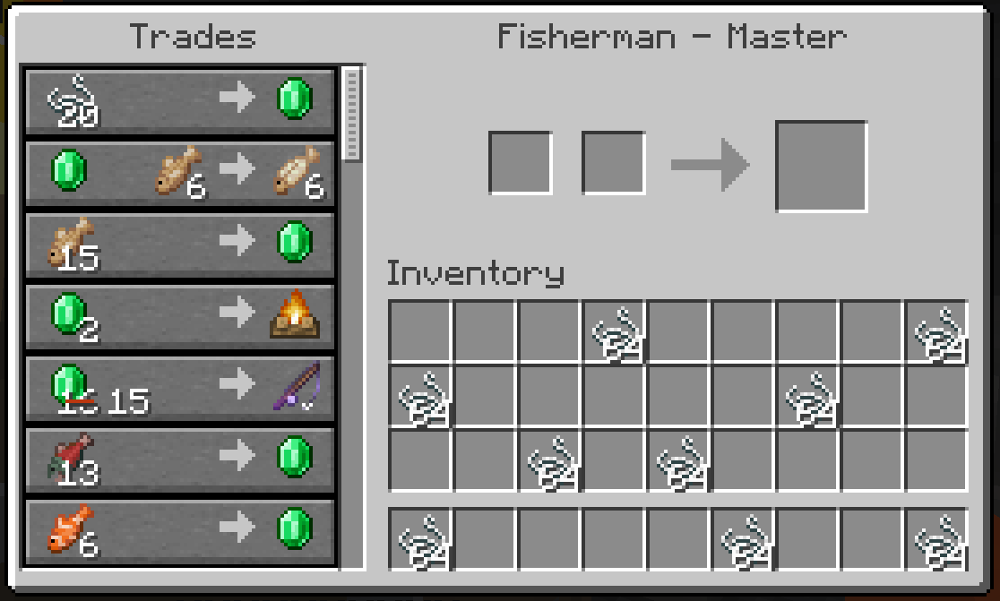

# Minecraft Automation
The goal of this project is to use Python to automate trivial tasks in Minecraft using Python. To control the mouse and keyboards inputs we will use [PyAutoGui](https://pyautogui.readthedocs.io/en/latest/).


## Task 1: Villager Trading
Let's begin by automating the task of trading with villagers. We will be trading string for emeralds during this task. We must click on the string in our inventory and place it into the villagers inventory. Next, we need to shift+click the emeralds and get the remaining string from the villager's inventory. 

### Absolute Positions
If we enforce the placement of the string, to be the top row of the player's inventory, then this task can be completed using `pyautogui.moveTo(x,y)` and `pyautogui.click()`. Note that for pyautogui to be able to move the mouse within Minecraft, we need to have the Minecraft client in windowed mode and raw mouse inputs to be turned off (Options -> Controls -> Mouse Settings -> Raw Input: Off).

To find the absolute positions of the desired locations, we can print the current mouse position using
```
current_mouse_position = pyautogui.position()
print(f"Current mouse position: {current_mouse_position}")
```
Now that we have the absolute positions, we can complete this task using the following script 
```
y_pos = 590
x_pos = 880
for i in range(5):
    #move to the string
    pyautogui.moveTo(x=x_pos, y=y_pos)
    pyautogui.click()
    
    #move to the trade slot
    pyautogui.moveTo(x=990, y=390)
    pyautogui.click()
    
    #get emeralds
    pyautogui.keyDown("shift")
    pyautogui.moveTo(x=1320, y=400) 
    pyautogui.click()
    
    pyautogui.moveTo(x=990, y=390)
    pyautogui.click()
        
    pyautogui.keyUp("shift")
    
    x_pos += 65
```
Here `x_pos` and `y_pos` are the absolute position of the left-top most item in the players inventory. We then use a simple for loop to trade with the villager and then incriminate the position `x_pos` to the next item in the players inventory. We note that we loop five times here as the villager will run out of trades on the fifth iteration.

### Random Positions
While the absolute position method works, we wish to expand the code to trade string that is anywhere in the players inventory rather than in a hard-coded location. 

Let's begin by taking a screenshot of the players screen and a screen shot of the string stack.




We will use cv2 to load the images as follows:
```
inventory_img = cv2.imread("./images/random.PNG", cv2.IMREAD_UNCHANGED)
string_img = cv2.imread("./images/string.PNG", cv2.IMREAD_UNCHANGED)
```
Now we will use the `matchTemplate` command from cv2 to create a heatmap of the most likely positions of the string. 
```
result = cv2.matchTemplate(inventory_img, string_img, cv2.TM_CCOEFF_NORMED)
cv2.imshow("Result", result)
cv2.waitKey()
cv2.destroyAllWindows()
```
Note that `cv2.TM_CCOEFF_NORMED` is an image kernel provided by cv2. Running this code, yields

Original             |  matchTemplate
:-------------------------:|:-------------------------:
  |  

We can see that the strongest matches (look at the white dots) align with the positions of the string in the inventory. While the dots are not in the center of the grid, we can easily fix this later on. To extract the (x,y) positions, we can set a threshold value and use numpy as follows:
```
result = cv2.matchTemplate(inventory_img, string_img, cv2.TM_CCOEFF_NORMED)
threshold = 0.8
yloc, xloc = np.where( result >= threshold)
print(len(xloc))
```
Running this code returns `9` as desired since there are nine stacks of string in the inventory. Now we need to slightly adjust the `(xloc,yloc)` position such that when the mouse clicks on the location, it will pick up the string. Noticing that the dots are in the upper left corner of the square, we can shift the position slightly to the right and up to get within the correct cell of the inventory. Putting this all together, gives the (x,y) positions of the points in red:


Now rather than using a preset inventory image, we can use `pyautogui.screenshot()` to get an image of the player's current inventory. Using the same method described in the absolute positions to click the string stacks within the inventory, gives us our desired script!
```
screenshot = pyautogui.screenshot()
inventory_img = cv2.cvtColor(np.array(screenshot), cv2.COLOR_RGB2BGR)
inventory_img_gray = cv2.cvtColor(inventory_img, cv2.COLOR_BGR2GRAY)

string_img = cv2.imread("./images/string.PNG", cv2.IMREAD_UNCHANGED)
string_img_gray = cv2.cvtColor(string_img, cv2.COLOR_BGR2GRAY)

result = cv2.matchTemplate(inventory_img_gray, string_img_gray, cv2.TM_CCOEFF_NORMED)
threshold = 0.8
yloc, xloc = np.where( result >= threshold)
xloc_shifted = [x + 20 for x in xloc]
yloc_shifted = [y + 20 for y in yloc]

for (x_pos, y_pos) in zip(xloc_shifted, yloc_shifted):
    #move to the string
    pyautogui.moveTo(x=x_pos, y=y_pos)
    pyautogui.click()
    
    #move to the trade slot
    pyautogui.moveTo(x=990, y=390)
    pyautogui.click()
    
    #get emeralds
    pyautogui.keyDown("shift")
    pyautogui.moveTo(x=1320, y=400) 
    pyautogui.click()
    
    pyautogui.moveTo(x=990, y=390)
    pyautogui.click()
        
    pyautogui.keyUp("shift")
```
Note that we required to turn both `inventory_img` and `string_img` into a gray scale for the matchTemplate to work.

### Modifications
The first modification we would like to add, is to detect if the villager is maxed on trades. When this occurs, the user sees the following:


So after each trade is completed, let's use the cv2's template match to see if the crossed out arrow is present. If the resulting (x,y) list is nonzero, we know that the villager is maxed.
```
#check to see if the villager is maxed
screenshot = pyautogui.screenshot()
inventory_img = cv2.cvtColor(np.array(screenshot), cv2.COLOR_RGB2BGR)
inventory_img_gray = cv2.cvtColor(inventory_img, cv2.COLOR_BGR2GRAY)
maxed_img = cv2.imread("./images/finished.PNG", cv2.IMREAD_UNCHANGED)
maxed_img_gray = cv2.cvtColor(maxed_img, cv2.COLOR_BGR2GRAY)
result = cv2.matchTemplate(inventory_img_gray, maxed_img_gray, cv2.TM_CCOEFF_NORMED)
threshold = 0.9
xloc, yloc = np.where( result >= threshold)
if(len(xloc) > 0):
    print("Villager is maxed")
    break
```